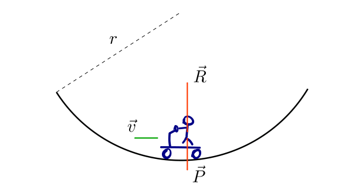

Descriviamo il moto dell'auto e le forze agenti sul guidatore rispetto al sistema di riferimento **inerziale** del suolo. Nel percorrere l'avvallamento, l'auto compie un moto circolare uniforme con velocità tangenziale

$$v = 95 \,\mathrm{km/h} = 26,\!4 \,\mathrm{m/s}$$

Di conseguenza, l'accelerazione sperimentata dal guidatore corrisponde all'**accelerazione centripeta** $$a = v^2 / r$$ diretta verso l'alto.

Le forze agenti sul guidatore sono:

* il peso $$P = -mg$$ del guidatore (diretto verso il basso)
* la reazione vincolare $$R = 2mg$$ (intensità doppia rispetto al peso, ma diretta verso l'alto)

Scriviamo la **seconda legge di Newton** relativa al guidatore, notando che la massa $$m$$ del guidatore si semplifica:

$$
\begin{aligned}
    F &= ma\\
    R + P &= ma\\
    2mg - mg &= m \frac{v^2}{r}\\
    g &= \frac{v^2}{r}
\end{aligned}
$$

Da qui possiamo facilmente ricavare il raggio $$r$$ dell'avvallamento e accorgerci che il risultato trovato (come previsto) non dipende da $$m$$.

$$
g = \frac{v^2}{r} \, \rightarrow \, r = \frac{v^2}{g} = \frac{26,\!4^2}{9,\!81} = 71 \,\mathrm{m}
$${:.scroll-wrapper}
