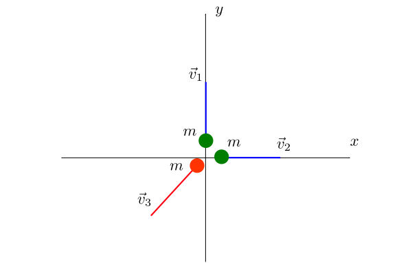

Poiché il moto dei tre frammenti avviene su un piano orizzontale (il pavimento), possiamo trascurare la velocità verticale di caduta e supporre che il piatto sia inizialmente fermo sul pavimento. Per cui la quantità di moto del sistema è $$\vec{p} = 0$$.

Dopo la rottura del piatto la quantità di moto totale del sistema non cambia (**principio di conservazione**), cioè abbiamo

$$
\begin{aligned}
    m\vec{v}_1 + m\vec{v}_2 + m\vec{v}_3 &= 0\\
    \vec{v}_1 + \vec{v}_2 + \vec{v}_3 &= 0\\
    \vec{v}_3 &= - \left( \vec{v}_1 + \vec{v}_2 \right)
\end{aligned}
$$

Dato che i vettori $$\vec{v}_1$$ e $$\vec{v}_2$$ hanno entrambi lo stesso modulo $$v$$, la loro somma $$\vec{v}_1 + \vec{v}_2$$ è un vettore diretto lungo la bisettrice del primo quadrante con modulo $$\sqrt{2}v$$. Concludiamo che la velocità $$\vec{v}_3$$ del terzo frammento è diretta lungo la bisettrice del terzo quadrante e ha modulo $$\sqrt{2}v$$.
