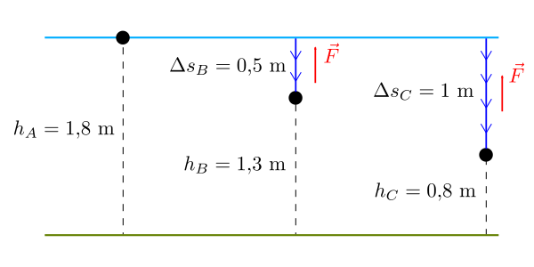

Rappresentiamo il problema con un disegno osservando che, in ciascuno dei tre casi, *la profondità* del sasso corrisponde allo *spazio percorso* $$\Delta s$$.

### Caso a) ###

Il sasso è fermo, per cui $$K_A = 0$$. Di conseguenza, l'energia meccanica è interamente costituita da energia potenziale gravitazionale:

$$E_A = K_A + U_A = 0 + mgh_A = 33,\!6 \,\,\mathrm{J}$$

### Caso b) ###

La forza di attrito $$\vec{F}$$ dell'acqua compie un lavoro pari a

$$L = -F \cdot \Delta s_B = -2,\!3 \,\,\mathrm{J}$$

Questo lavoro corrisponde alla variazione di energia meccanica del sasso:

$$E_B = E_A + L = 33,\!6 - 2,\!3 = 31,\!3 \,\,\mathrm{J}$$

Infine, poiché l'energia potenziale è $$U_B = mgh_B = 24,\!2 \,\,\mathrm{J}$$, possiamo facilmente calcolare anche il valore dell'energia cinetica:

$$E_B = K_B + U_B \,\longrightarrow\, K_B = E_B - U_B = 7,\!1 \,\,\mathrm{J}$$

### Caso c) ###

Si tratta di una situazione del tutto analoga a quella del caso b). Stavolta il lavoro compiuto dalla forza di attrito durante la discesa del sasso dalla superficie è

$$L = -F \cdot \Delta s_C = -4,\!6 \,\,\mathrm{J}$$

Inoltre abbiamo $$E_C = E_A + L$$.
