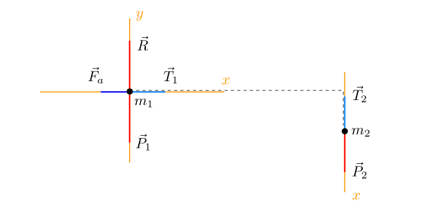

## Testo

### Esercizio 1

Un treno (A) viaggia alla velocità costante di 72 m/s. Guardando dal finestrino, un passeggero osserva un secondo treno (B) passargli accanto in direzione opposta a una velocità di 5 m/s.

* Qual è la velocità (direzione e modulo) del treno B rispetto al suolo?
* I due treni A e B sono sistemi di riferimento inerziali? Perché?
* Supponiamo di essere su uno dei due treni, in un vagone isolato senza finestrini. È possibile effettuare un esperimento per capire se ci troviamo su A oppure su B?

[Soluzione](#esercizio-1-1)

### Esercizio 2

Una pallina di gomma di 250 g viene fatta rimbalzare verticalmente sul pavimento. Si osserva che, dopo essere stata a contatto con il pavimento per $$0,\!02$$ s, la velocità $$v = 6$$ m/s con cui la pallina rimbalza è la stessa con cui ha toccato terra.

* Determinare la variazione di quantità di moto della pallina durante il rimbalzo.
* Qual è la forza media esercitata dal pavimento sulla pallina?

[Soluzione](#esercizio-2-1)

### Esercizio 3

Un blocco di massa $$m_1 = 2,\!4$$ kg su un piano orizzontale è collegato tramite una carrucola a un secondo blocco sospeso di massa $$m_2 = 1,\!5$$ kg.

Determinare il valore dell'accelerazione dei due blocchi, sapendo che il coefficiente di attrito dinamico tra il primo blocco e il tavolo è $$\mu_d = 0,\!3$$.

[Soluzione](#esercizio-3-1)

## Svolgimento

### Esercizio 1

Indicando con $$S$$ e $$S'$$ i due sistemi di riferimento rispettivamente del suolo e del treno A, rappresentiamo la situazione con un disegno:

Rispetto ad un asse $$x$$  diretto come in figura, i dati a nostra disposizione sono $$V = 72$$ m/s (velocità di $$S'$$ rispetto a $$S$$) e $$v' = -5$$ m/s (velocità del treno B nel sistema di riferimento $$S'$$).

* Il testo chiede di calcolare il valore di $$v$$, cioè la velocità del treno B rispetto a $$S$$, che possiamo dedurre dalla **trasformazione di Galileo** delle velocità:

  $$
      v' = v - V \, \longrightarrow v = V + v' = 72 - 5 = 62 \text{ m/s}
  $${:.scroll-wrapper}

* Entrambi i treni sono sistemi di riferimento inerziali poiché viaggiano entrambi a velocità costante.

* Il **principio di relatività** di Galileo afferma che la legge fondamentale della dinamica $$\vec{F} = m\vec{a}$$ è valida in *qualsiasi* sistema di riferimento inerziale: in particolare, qualsiasi esperimento di dinamica darà lo stesso esito indipendentemente dal treno su cui viene eseguito.

[Top](#esercizio-1)

### Esercizio 2

Rispetto all'asse $$y$$ fissato verticalmente come in figura, le due velocità (iniziale e finale) della pallina sono rispettivamente

$$v_i = -6 \,\mathrm{m/s} \quad\text{e}\quad v_f = +6 \,\mathrm{m/s}$$

* Dalla definizione di quantità di moto $$p = mv$$, possiamo facilmente calcolare la variazione $$\Delta p$$ come segue:

   $$
   \Delta p = p_f - p_i = mv_f - mv_i = m(v_f - v_i)= 0,\!250 \cdot \left(6 - (-6)\right) = 3 \,\mathrm{kg \cdot m/s}
   $${:.scroll-wrapper}

* Il **teorema dell'impulso** afferma che $$F \cdot \Delta t = \Delta p$$, dove $$F$$ è la forza (media) esercitata dal pavimento sulla pallina e $$\Delta t = 0,\!02$$ s è il tempo di contatto. Con una semplice formula inversa ricaviamo

   $$
   F = \frac{\Delta p}{\Delta t} = \frac{3}{0,\!02} = 150 \,\mathrm{N}
   $$

[Top](#esercizio-2)

### Esercizio 3

Per ciascuno dei due blocchi, rappresentiamo nello schema di corpo libero tutte le forze agenti. Inoltre, poiché i due corpi sono legati e **si muovono insieme**, è opportuno orientare gli assi di riferimento nella stessa direzione del moto:

Sappiamo che i due corpi hanno la stessa accelerazione ($$a_1 = a_2 = a$$) e che la tensione ai due capi della corda è la stessa ($$T_1 = T_2 = T$$).

Poiché il primo blocco non si muove verticalmente, le due uniche forze verticali presenti (il peso del blocco e la reazione vincolare del piano su cui è appoggiato) si annullano a vicenda:

$$R - P_1 = 0 \, \longrightarrow \, R = P_1 = m_1g$$

Di conseguenza, l'intensità della forza di attrito dinamico $$\vec{F}_a$$ agente sul primo blocco risulta

$$F_a = R \cdot \mu_d = m_1g \, \mu_d$$

Possiamo allora concludere che la seconda legge di Newton per il **primo blocco** è data dall'equazione

$$
    -F_a + T = m_1a \, \longrightarrow \, -m_1g \, \mu_d + T = m_1a
$$

Sul **secondo blocco**, sospeso, le due uniche forze agenti (entrambe verticali) sono il peso del blocco e la tensione della corda: in questo caso la seconda legge di Newton è semplicemente

$$
    P_2 - T = m_2a \, \longrightarrow \, m_2 g - T = m_2a
$$

Sommando membro a membro le due equazioni così ottenute riusciamo a eliminare la variabile $$T$$ e a ricavare il valore dell'accelerazione con cui i due blocchi si spostano (il primo verso destra e il secondo verso il basso):

$$
(m_2 - m_1\,\mu_d)g = (m_1 + m_2)a \, \longrightarrow \, a = \frac{(m_2 - m_1 \, \mu_d)g}{m_1 + m_2} = 1,\!96 \, \mathrm{m/s^2}
$${:.scroll-wrapper}

[Top](#esercizio-3)
