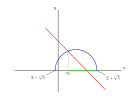

Dopo aver individuato le funzioni $$y_1 = \sqrt{1 + 4x - x^2}$$ e $$y_2 = 3 - x$$, tracciamo il grafico di ciascuna di esse nel piano cartesiano.

## Grafico di $$y_1$$

Si tratta di una funzione irrazionale.

1. Risolviamo la disequazione $$1 + 4x - x^2 \geq 0$$ per trovare il **dominio** di $$y_1$$, cioè i valori di $$x$$ in corrispondenza di cui la funzione è definita. Otteniamo

   $$
     2 - \sqrt{5} \leq x \leq 2 + \sqrt{5}
   $$
   
2. Essendo definita da una radice quadrata, la funzione è **non negativa**. Di conseguenza, i punti del suo grafico si trovano tutti **al di sopra** dell'asse $$x$$ (oppure sull'asse $$x$$ stesso).

3. Elevando al quadrato entrambi i membri dell'espressione analitica $$y = \sqrt{1 + 4x - x^2}$$, troviamo

   $$
     x^2 + y^2 - 4x - 1 = 0
   $$
   
   che è l'equazione di una circonferenza di centro $$(2, 0)$$ e raggio $$\sqrt{5}$$. Per le considerazioni fatte al punto 2, concludiamo che il grafico di $$y_1$$ è la parte superiore di tale circonferenza. Osserviamo che il grafico interseca l'asse $$x$$ proprio nei punti di ascissa
   
   $$
     x = 2 - \sqrt{5} \qquad \text{e} \qquad x = 2 + \sqrt{5}
   $$

## Grafico di $$y_2$$

Si tratta di una funzione lineare, il cui grafico è la retta parallela alla bisettrice del II e del IV quadrante (poiché $$m=-1$$) e passante per il punto $$(0,3)$$ (poiché $$q = 3$$).

## Conclusioni

Le soluzioni della disequazione $$y_1 \geq y_2$$ sono i valori di $$x$$ in corrispondenza in cui il grafico di $$y_1$$ è alla stessa altezza o al di sopra del grafico di $$y_2$$. Osservando la figura possiamo concludere che le soluzioni cercate sono

$$
  x_0 \leq x \leq 2 + \sqrt{5}
$$

dove $$x_0$$ è l'ascissa dell'unico punto di intersezione dei grafici.

## Valore esatto di $$x_0$$

Per trovare il valore esatto di $$x_0$$ (in corrispondenza di cui i due grafici sono alla stessa altezza) risolviamo l'**equazione** $$y_1 = y_2$$:

$$
  \sqrt{1 + 4x - x^2} = 3 - x
$$

La condizione di **concordanza del segno** è data da

$$
  3 - x \geq 0\, \rightarrow \, x \leq 3
$$

Elevando al quadrato entrambi i membri dell'equazione, otteniamo l'equazione di secondo grado

$$
  x^2 - 5x + 4 = 0 \, \rightarrow \, (x - 4)(x - 1) = 0
$$

che ha per soluzioni i due valori $$x = 1$$ e $$x = 4$$, ma l'unica che verifica la concordanza del segno è $$x = 1$$.

Abbiamo scoperto che $$x_0 = 1$$: possiamo dunque affermare che le soluzioni della disequazione di partenza sono date da

$$
  1 \leq x \leq 2 + \sqrt{5}
$$
