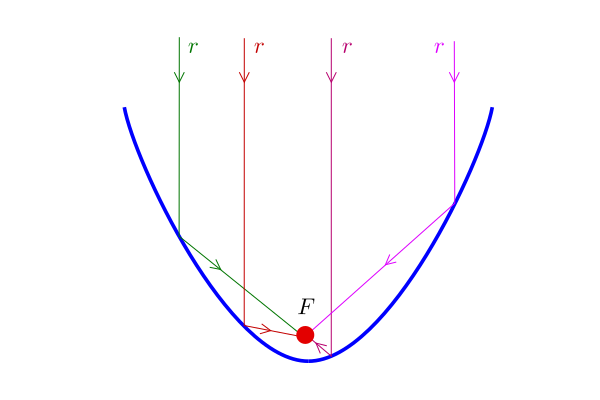
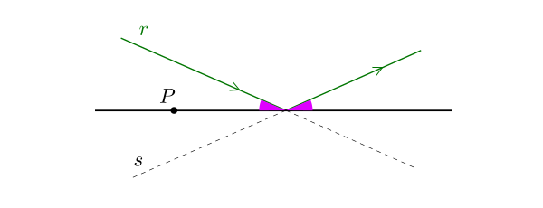
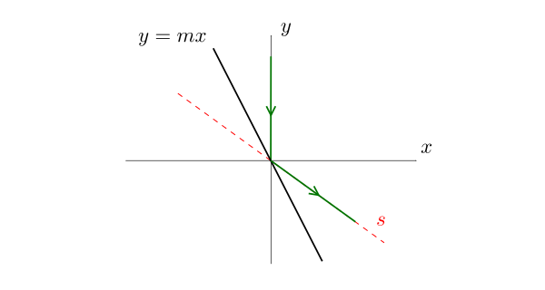

Una superficie a forma di parabola è colpita da un raggio di luce $$r$$ parallelo al suo asse. Svolgendo questa serie di esercizi riusciremo a dimostrare che, qualunque sia $$r$$, **il raggio riflesso colpirà il fuoco $$F$$ della parabola**:

Prima di iniziare, facciamo una piccola premessa sul principio alla base della riflessione della luce.

### Come funziona la riflessione

Molto semplice: se un raggio di luce incontra una superficie piana viene riflesso con lo **stesso angolo** con cui colpisce la superficie.

In particolare, qualsiasi punto $$P$$ scelto sulla superficie si trova alla **stessa distanza** dalla retta $$r$$ e dalla retta $$s$$ indicate in figura.

## Esercizio 1

Nel piano cartesiano, un raggio di luce è diretto verso il basso lungo l'asse $$y$$. Se il raggio colpisce la retta di equazione $$y = mx$$, qual è l'equazione della retta $$s$$ del raggio riflesso?

