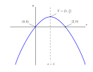
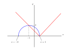

## Testo

### Esercizio 1

Consideriamo la parabola descritta dall'equazione

$$y = -\frac12 x^2 + kx$$

dipendente dal parametro $$k$$.

###### Punto a)

Determinare per quale valore di $$k$$ l'asse di simmetria della parabola è la retta verticale di equazione $$x = 1$$.

###### Punto b)

Per il valore di $$k$$ trovato al punto precedente, disegnare la parabola nel piano cartesiano specificando le coordinate del vertice e dei punti di intersezione con gli assi cartesiani.

###### Punto c)

Per quali valori di $$k$$ la parabola *non ha* punti di intersezione con l'asse $$x$$?

[Soluzione](#esercizio-1-1)

### Esercizio 2

Risolvere graficamente la disequazione

$$\sqrt{3 - 2x - x^2} \leq \vert x - 1\vert$$

[Soluzione](#esercizio-2-1)

### Esercizio 3

Consideriamo la parabola $$\gamma$$ di equazione $$y = x^2 - 4x - 3$$.

###### Punto a)

Determinare l'equazione delle rette tangenti a $$\gamma$$ e passanti per il punto di coordinate $$(1,-7)$$.

###### Punto b)

Determinare l'equazione della retta tangente a $$\gamma$$ nel suo punto di intersezione con l'asse $$y$$.

###### Punto c)

Scrivere l'equazione della parabola simmetrica di $$\gamma$$ rispetto all'asse $$y$$.

[Soluzione](#esercizio-3-1)

## Svolgimento

### Esercizio 1

###### Punto a)

La parabola di equazione $$y = ax^2 + bx + c$$ ha come asse di simmetria la retta di equazione $$x=-b/2a$$. Poiché nel nostro caso $$a=-1/2$$ e $$b = k$$, troviamo

$$-\frac{b}{2a} = 1 \,\longrightarrow\, k = 1$$

###### Punto b)

In corrispondenza di $$k = 1$$, l'equazione della parabola diventa

$$y = -\frac12 x^2 + x$$

Osserviamo subito che la concavità è rivolta verso il basso. Inoltre, essendo $$c = 0$$, la parabola passa per l'origine $$(0,0)$$ e, per simmetria, anche per il punto di coordinate $$(2,0)$$.
  
Per determinare l'altezza del vertice $$y_V$$ è sufficiente sostituire il valore $$x = 1$$ nell'equazione della parabola:

$$y_V = -\frac12 \cdot 1^2 + 1 = \frac12$$

###### Punto c)

Abbiamo che $$c = 0$$ *indipendentemente* da $$k$$. Di conseguenza, per qualsiasi valore di $$k$$, la parabola ha almeno un punto (l'origine) in comune con l'asse $$x$$.

[Top](#testo)

### Esercizio 2

Tracciamo i grafici delle due funzioni

$$y_1 = \sqrt{3 - 2x - x^2} \qquad \text{e} \qquad y_2 = \vert x - 1 \vert$$

* Poiché $$y_1 \geq 0$$, il grafico di $$y_1$$ si trova *non al di sotto* dell'asse $$x$$. Elevando al quadrato otteniamo l'equazione

  $$x^2 + y^2 + 2x - 3 = 0 \, \longrightarrow \, (x + 1)^2 + y^2 = 4$$
  
  che rappresenta una circonferenza di centro $$(-1,0)$$ e raggio $$2$$. Il grafico di $$y_1$$ è dunque la parte superiore di tale circonferenza.
  
* La funzione $$y_2 = \vert x - 1 \vert$$ è ottenuta da $$y = \vert x \vert$$ mediante la trasformazione $$x \to x - 1$$. Per cui il grafico corrispondente è traslato verso destra di $$1$$.

Dai due grafici possiamo dedurre che

* $$y_1 < y_2\,$$ se $$\,-3 \leq x < -1$$
* $$y_1 = y_2\,$$ se $$\,x = -1$$ oppure se $$x = 1$$

Concludiamo che le soluzioni della disequazione $$y_1 \leq y_2$$ sono date da

$$-3 \leq x \leq -1 \, \vee \, x = 1$$

[Top](#testo)

### Esercizio 3

###### Punto a)

La generica retta $$t$$ passante per il punto di coordinate $$(1,-7)$$ ha equazione

$$t \, \colon \, y = m(x - 1) - 7$$

Mettendo a sistema l'equazione di $$t$$ con quella di $$\gamma$$, otteniamo l'*equazione risolvente*

$$
\begin{aligned}
x^2 - 4x - 3 &= mx - m - 7\\
x^2 - (m + 4)x + m + 4 &= 0
\end{aligned}
$$

Il discriminante dell'equazione è

$$
\begin{aligned}
\Delta &= (m + 4)^2 - 4(m + 4)\\
       &= m^2 + 4m\\
       &= m(m + 4)
\end{aligned}
$$

Dalla *condizione di tangenza* $$\Delta = 0$$ ricaviamo le due soluzioni $$m_1 = 0$$ e $$m_2  =-4$$, a cui corrispondono le due rette tangenti di equazione

$$t_1 \,\colon\, y = -7 \quad \text{e} \quad t_2 \,\colon\, y = -4x -3$$

Osserviamo che la retta $$t_1$$ è una tangente orizzontale che, pertanto, passa per il vertice di $$\gamma$$.

###### Punto b)

Dalla sua equazione si deduce immediatamente che la parabola $$\gamma$$ interseca l'asse $$y$$ nel punto $$P = (0,-3)$$. Poiché $$P$$ è un punto della retta $$t_2$$ trovata al punto precedente, questa è la retta tangente alla parabola in $$P$$.

###### Punto c)

Trasformando l'equazione di $$\gamma$$ mediante la simmetria rispetto all'asse $$y$$:

$$
\begin{aligned}
  x &\to -x\\
  y &\to y
\end{aligned}
$$

otteniamo l'equazione $$y = x^2 + 4x - 3$$.

[Top](#testo)
