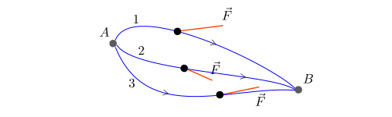

## Lavoro di una forza

Consideriamo un corpo che si sposta da un punto $$A$$ a un punto $$B$$ sotto l'azione di una forza $$\vec{F}$$. In generale, non è detto che il vettore $$\vec{F}$$ sia parallelo allo spostamento del corpo.

Se il percorso da $$A$$ a $$B$$ è rettilineo e la forza $$\vec{F}$$ è costante, allora il **lavoro** $$L$$ di $$\vec{F}$$ è la grandezza scalare definita da

$$L_{A \to B} = F \cdot \Delta s \cdot \cos \alpha$$

Come l'energia, l'unità di misura del lavoro nel SI è il *joule* (J). A seconda dell'angolo $$\alpha$$ che la forza $$\vec{F}$$ forma con lo spostamento, possiamo avere

* $$L>0$$ (lavoro motore)
* $$L<0$$ (lavoro resistente)
* $$L=0$$ (lavoro nullo)

A partire da questa formula per $$L$$, è possibile definire il lavoro di una forza anche nel caso in cui $$\vec{F}$$ non è costante oppure il percorso da $$A$$ a $$B$$ non è rettilineo.

## Forze conservative

In generale il lavoro $$L_{A \to B}$$ dipende, oltre che dal punto di partenza $$A$$ e dal punto di arrivo $$B$$, anche dal particolare percorso lungo il quale avviene lo spostamento.

Una forza $$\vec{F}$$ si definisce **conservativa** se, comunque scelti $$A$$ e $$B$$, il lavoro $$L_{A \to B}$$ **è lo stesso lungo qualsiasi percorso** che da $$A$$ porta in $$B$$:

$$L_1 = L_2 = L_3$$

A ogni forza conservativa $$\vec{F}$$ corrisponde un'**energia potenziale** $$U$$: a ogni punto $$P$$ è associato un valore numerico $$U_P$$ con la seguente proprietà fondamentale:

$$L_{A \to B} = U_A - U_B$$

Ovvero, il lavoro di una forza conservativa lungo un percorso da $$A$$ a $$B$$ è uguale alla differenza di energia potenziale agli estremi $$A$$ e $$B$$.

## Forza di gravità

La forza di gravità che agisce un corpo di massa $$m$$ è una forza conservativa la cui energia potenziale è

$$U_P = mgh_P$$

dove $$h_P$$ indica l'**altezza** del punto $$P$$ rispetto al suolo (o a qualsiasi altro piano orizzontale fissato). In particolare, il lavoro compiuto dalla forza di gravità nello spostamento del corpo da $$A$$ a $$B$$ risulta

$$
  L_{A \to B} = U_A - U_B = mgh_A - mgh_B = mg(h_A - h_B)
$${:.scroll-wrapper}

indipendentemente dal percorso seguito.
