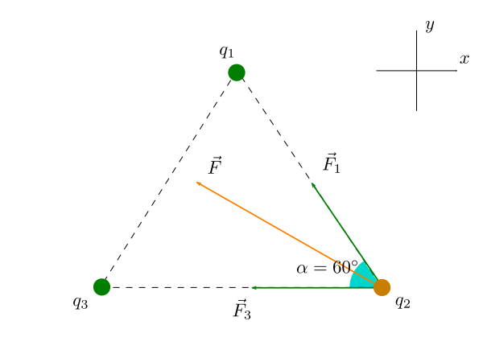

In figura sono rappresentate le due forze elettriche $$\vec{F}_1$$ e $$\vec{F}_3$$ esercitate dalle due cariche positive $$q_1$$ e $$q_3$$ sulla carica negativa $$q_2$$:

Osserviamo che, in base alla **legge di Coulomb**, entrambe le forze hanno la stessa intensità:

$$
    F_1 = F_3 = k \frac{q^2}{l^2}
$$

dove $$q = 12 \, \mathrm{\mu C}$$ e $$l = 19 \, \mathrm{cm}$$.

### Punto a)

Determiniamo la forza risultante $$\vec{F} = \vec{F}_1 + \vec{F}_3$$ utilizzando il *metodo delle componenti*.

1. Le componenti $$x$$ e $$y$$ della forza $$\vec{F}_1$$ sono:

   $$
   \begin{aligned}
       F_{1x} &= -F_1 \cos \alpha = -\frac12 \, k \frac{q^2}{l^2}\\
       & \\
       F_{1y} &= F_1 \sin \alpha = \frac{\sqrt{3}}{2} \, k \frac{q^2}{l^2}
   \end{aligned}
   $$

2. Le componenti $$x$$ e $$y$$ della forza $$\vec{F}_3$$ sono:
   
   $$
   \begin{aligned}
       F_{3x} &= -F_3 = -k \frac{q^2}{l^2}\\
       F_{3y} &= 0
   \end{aligned}
   $$
   
3. Di conseguenza, le due componenti $$x$$ e $$y$$ della forza risultante $$\vec{F}$$ sono date dalla somma componente per componente di $$\vec{F}_1$$ e $$\vec{F}_3$$:

   $$
   \begin{aligned}
       F_x &= F_{1x} + F_{3x} = - \frac32 \, k \frac{q^2}{l^2}\\
       & \\
       F_y &= F_{1y} + F_{3y} = \frac{\sqrt{3}}{2} \, k \frac{q^2}{l^2}
   \end{aligned}
   $$

A questo punto è facile calcolare:

* l'intensità della forza $$\vec{F}$$, come

  $$
    F = \sqrt{F_x^2 + F_y^2} = \sqrt{3} \, k \frac{q^2}{l^2} = 62,\!18 \, \mathrm{N}
  $${:.scroll-wrapper}

* l'angolo che il vettore $$\vec{F}$$ forma con il semiasse positivo delle $$x$$, come

  $$
      \theta = \arctan \frac{F_y}{F_x} = \arctan \left( - \frac{\sqrt{3}}{3} \right) = 150^\circ
  $${:.scroll-wrapper}
  
  **N.B.** Si poteva arrivare allo stesso risultato osservando che il vettore $$\vec{F}$$ è necessariamente diretto lungo la bisettrice dell'angolo formato da $$\vec{F}_1$$ e $$\vec{F}_3$$.

### Punto b)

Abbiamo visto che l'angolo $$\theta$$ non dipende da $$l$$: dunque, se $$l' = 3l$$, la direzione della forza risultante non cambierebbe. Invece, per quanto riguarda l'intensità di $$\vec{F}$$, avremmo

$$
    F' = \sqrt{3} \, k \frac{q^2}{(l')^2} = \frac19 \, \underbrace{ \sqrt{3} \, k \frac{q^2}{l^2}}_{F} = \frac19 F
$${:.scroll-wrapper}

Dunque l'intensità della forza risultante sarebbe 9 volte più piccola.
