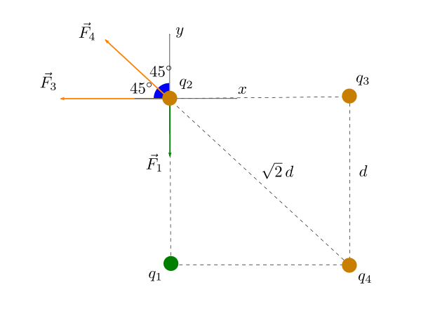

Possiamo individuare **tre forze** che agiscono sulla carica $$q_2$$ come indicato in figura: la forza $$\vec{F}_1$$ è la forza di attrazione dovuta alla presenza della carica positiva $$q_1$$, mentre $$\vec{F}_3$$ e $$\vec{F}_4$$ sono le due forze repulsive esercitate dalle cariche negative $$q_3$$ e $$q_4$$.

Calcoliamo l'intensità di ciascuna forza mediante la legge di Coulomb:

$$
\begin{aligned}
    F_1 &= k \, \frac{\vert q_1 \cdot q_2 \vert}{d^2} = 2k \, \frac{q^2}{d^2}\\
    F_3 &= k \, \frac{\vert q_2 \cdot q_3 \vert}{d^2} = 6k \, \frac{q^2}{d^2}\\
    F_4 &= k \, \frac{\vert q_2 \cdot q_4 \vert}{(\sqrt{2} \, d)^2} = 4k \, \frac{q^2}{d^2}
\end{aligned}
$$

Rispetto al sistema di assi cartesiani fissato come in figura, determiniamo le componenti $$x$$ e $$y$$ di ciascuna forza:

* il vettore $$\vec{F}_1$$ è diretto verticalmente verso il basso:

  $$
    F_{1x} = 0 \qquad F_{1y} = -F_1 = -2k \, \frac{q^2}{d^2}
  $$
  
* il vettore $$\vec{F}_3$$ è diretto orizzontalmente verso sinistra:
  
  $$
    F_{3x} = -F_3 = -6k \, \frac{q^2}{d^2} \qquad F_{3y} = 0
  $$

* il vettore $$\vec{F}_4$$ si trova nel secondo quadrante e le sue componenti differiscono solo per il segno:

  $$
    F_{4x} = -F_4 \cos 45^\circ =  -2\sqrt{2} k \, \frac{q^2}{d^2} \qquad F_{4y} = +F_4 \cos 45^\circ =  2\sqrt{2} k \, \frac{q^2}{d^2}
  $${:.scroll-wrapper}

A questo punto è facile calcolare le componenti della forza risultante $$\vec{F} = \vec{F}_1 + \vec{F}_2 + \vec{F}_3$$ come segue:

$$
\begin{aligned}
    F_x &= F_{1x} + F_{3x} + F_{4x} = -2\left(\sqrt{2} + 3 \right)k \, \frac{q^2}{d^2}\\
    F_y &= F_{1y} + F_{3y} + F_{4y} = 2\left(\sqrt{2} - 1 \right)k \, \frac{q^2}{d^2}
\end{aligned}
$$

Concludiamo che

* l'intensità della forza risultante sulla carica $$q_2$$ è pari a

  $$
  \begin{aligned}
      F = \sqrt{F_x^2 + F_y^2} &= 2 \sqrt{(\sqrt{2} + 3)^2 + (\sqrt{2} - 1)^2} \cdot 9 \cdot 10^9 \cdot \left( \frac{2,\!4 \cdot 10^{-6}}{0,\!33}\right)^2\\
      &\approx 4,\!22 \,\,\mathrm{N}
  \end{aligned}
  $${:.scroll-wrapper}
  
* poiché $$F_x < 0$$ e $$F_y > 0$$, il vettore $$\vec{F}$$ si trova nel secondo quadrante e l'angolo da esso formato con l'asse $$x$$ (misurato in senso antiorario) è

  $$
  \theta = \arctan \frac{F_y}{F_x} = -\frac{\sqrt{2} - 1}{\sqrt{2} + 3} \approx 174,\!64^\circ
  $$
